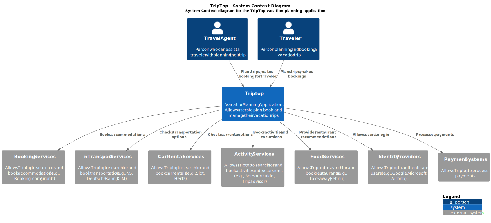
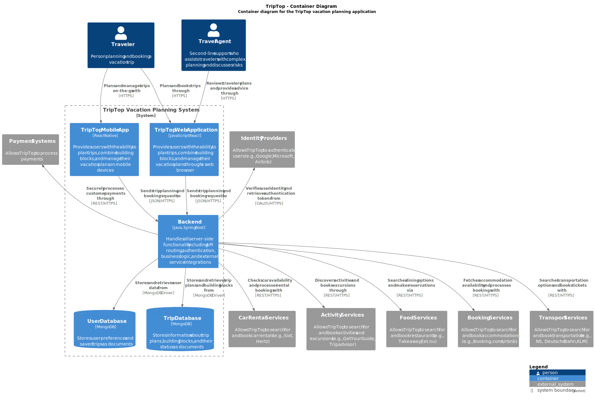
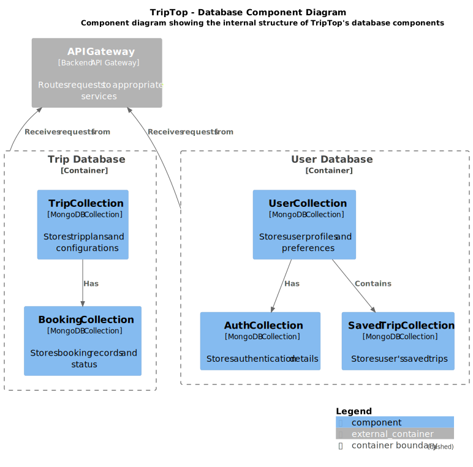
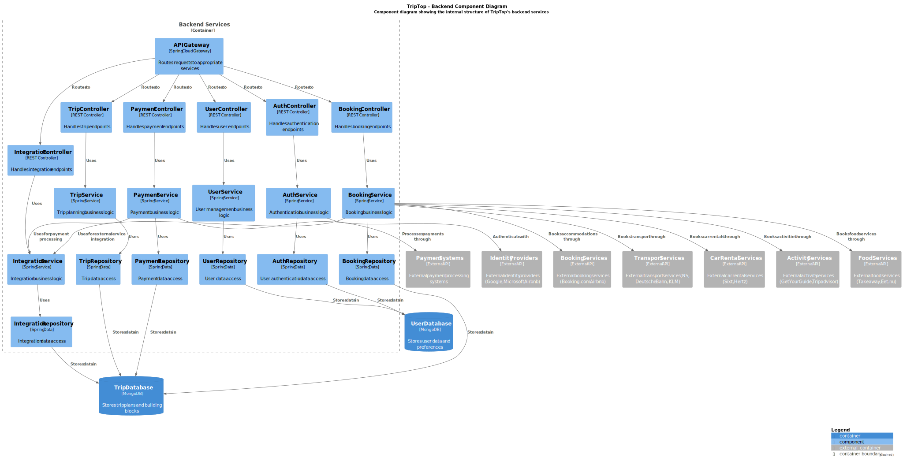
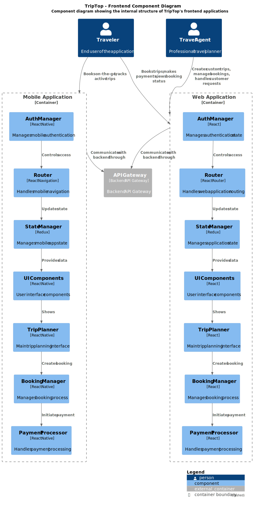

# Software Guidebook Triptop

## 1. Introduction
Dit software guidebook geeft een overzicht van de Triptop-applicatie. Het bevat een samenvatting van het volgende: 
1. De vereisten, beperkingen en principes. 
1. De software-architectuur, met inbegrip van de technologiekeuzes op hoog niveau en de structuur van de software. 
1. De ontwerp- en codebeslissingen die zijn genomen om de software te realiseren.
1. De architectuur van de infrastructuur en hoe de software kan worden geinstalleerd. 

## 2. Context

> [!IMPORTANT]
> Werk zelf dit hoofdstuk uit met context diagrammen en een beschrijving van de context van de software.
### context diagram

[View context diagram source](context-diagram/context-triptop.svg)

Toelichting op de context van de software inclusief System Context Diagram:
* Functionaliteit
* Gebruikers
* Externe systemen

## 3. Functional Overview

Om de belangrijkste features toe te lichten zijn er user stories en twee domain stories gemaakt en een overzicht van het domein in de vorm van een domeinmodel. Op deze plek staat typisch een user story map maar die ontbreekt in dit voorbeeld.

### 3.1 User Stories

#### 3.1.1 User Story 1: Reis plannen

Als gebruiker wil ik een zelfstandig op basis van diverse variabelen (bouwstenen) een reis kunnen plannen op basis van mijn reisvoorkeuren (wel/niet duurzaam reizen, budget/prijsklasse, 's nachts reizen of overdag etc.) zodat ik op vakantie kan gaan zonder dat hiervoor een reisbureau benodigd is.

#### 3.1.2 User Story 2: Reis boeken

Als gebruiker wil ik een geplande reis als geheel of per variabele (bouwsteen) boeken en betalen zodat ik op vakantie kan gaan zonder dat hiervoor een reisbureau benodigd is.

#### 3.1.3 User Story 3: Reis cancelen

Als gebruiker wil ik een geboekte reis, of delen daarvan, kunnen annuleren zodat ik mijn geld terug kan krijgen zonder inmenging van een intermediair zoals een reisbureau.

#### 3.1.4 User Story 4: Reisstatus bewaren 

Als gebruiker wil ik mijn reisstatus kunnen bewaren zonder dat ik een extra account hoef aan te maken zodat ik mijn reis kan volgen zonder dat ik daarvoor extra handelingen moet verrichten.

#### 3.1.5 User Story 5: Bouwstenen flexibel uitbreiden

Als gebruiker wil ik de bouwstenen van mijn reis flexibel kunnen uitbreiden met een zelf te managen stap (bijv. met providers die niet standaard worden aangeboden zoals een andere reisorganisatie, hotelketen etc.) zodat ik mijn reis helemaal kan aanpassen aan mijn wensen.

### 3.2 Domain Story Reis Boeken (AS IS)

### 3.3 Domain Story Reis Boeken (TO BE)

### 3.4 Domain Model

| class: attribute | is input voor API+endpoint | wordt gevuld door API+endpoint | wordt geleverd door eindgebruiker | moet worden opgeslagen in de applicatie |
|------------------|----------------------------|--------------------------------|-----------------------------------|-----------------------------------------|
| Trip::startDatum | Booking /search (POST), FlightScraper /flights (GET) |  | x | x |
| Trip::eindDatum | Booking /search (POST), FlightScraper /flights (GET) |  | x | x |
| Trip::budget |  |  | x | x |
| Excursie::titel |  | TripAdvisor /search |  | x |
| Excursie::datum |  | TripAdvisor /search |  | x |
| Excursie::startTijd |  | TripAdvisor /search |  | x |
| Excursie::eindTijd |  | TripAdvisor /search |  | x |
| Excursie::prijs |  | TripAdvisor /search |  | x |
| Reis::startDatum | FlightScraper /flights (GET) |  | x | x |
| Reis::eindDatum | FlightScraper /flights (GET) |  | x | x |
| Reis::prijs |  | FlightScraper /flights (GET) |  | x |
| Reis::vervoer |  |  | x | x |
| Verblijf::startDatum | Booking /search (POST) |  | x | x |
| Verblijf::eindDatum | Booking /search (POST) |  | x | x |
| Verblijfplaats::locatie |  | Booking /search (POST) |  | x |
| Verblijfplaats::prijs |  | Booking /search (POST) |  | x |
| Locatie::lat |  | Booking /search (POST), TripAdvisor /search |  | x |
| Locatie::lon |  | Booking /search (POST), TripAdvisor /search |  | x |
| Reiziger::voornaam |  |  | x | x |
| Reiziger::achternaam |  |  | x | x |
| Reiziger::telefoonnummer |  |  | x | x |
| Reservering::reserveringsnummer |  | Booking /confirm (POST), FlightScraper /book (POST) |  | x |
| Reservering::status |  | Booking /status (GET), FlightScraper /status (GET) |  | x |

## 4. Quality Attributes

Voordat deze casusomschrijving tot stand kwam, heeft de opdrachtgever de volgende ISO 25010 kwaliteitsattributen benoemd als belangrijk:
* Compatibility -> Interoperability (Degree to which a system, product or component can exchange information with other products and mutually use the information that has been exchanged)
* Reliability -> Fault Tolerance (Degree to which a system or component operates as intended despite the presence of hardware or software faults)
* Maintainability -> Modularity (Degree to which a system or computer program is composed of discrete components such that a change to one component has minimal impact on other components)
* Maintainability -> Modifiability (Degree to which a product or system can be effectively and efficiently modified without introducing defects or degrading existing product quality)
* Security -> Integrity (Degree to which a system, product or component ensures that the state of its system and data are protected from unauthorized modification or deletion either by malicious action or computer error)
* Security -> Confidentiality (Degree to which a system, product or component ensures that data are accessible only to those authorized to have access)

## 5. Constraints

> [!IMPORTANT]
> Beschrijf zelf de beperkingen die op voorhand bekend zijn die invloed hebben op keuzes die wel of niet gemaakt kunnen of mogen worden.

## 6. Principles

> [!IMPORTANT]
> Beschrijf zelf de belangrijkste architecturele en design principes die zijn toegepast in de software.

## 7. Software Architecture

###     7.1. Containers

[View container diagram source](container-diagram/container-triptop.svg)

###     7.2. Components

[View database component diagram source](component-diagram/database-component-diagram-triptop.svg)

[View backend component diagram source](component-diagram/backend-component-diagram-triptop.svg)

[View frontend component diagram source](component-diagram/frontend-component-diagram-triptop.svg)

###     7.3. Design & Code

> [!IMPORTANT]
> Voeg toe: Per ontwerpvraag een Class Diagram plus een Sequence Diagram van een aantal scenario's inclusief begeleidende tekst.

## 8. Architectural Decision Records

> [!IMPORTANT]
> Voeg toe: 3 tot 5 ADR's die beslissingen beschrijven die zijn genomen tijdens het ontwerpen en bouwen van de software.

### 8.1. ADR-001 TITLE

# Integration with Booking.com API for Accommodation Search

Date: 2024-03-21

## Status

Accepted

## Context

The Triptop application needs to provide accommodation search functionality to allow users to find and book hotels as part of their trip planning. Instead of building and maintaining our own accommodation database, we need to integrate with an existing service that provides comprehensive and up-to-date accommodation data.

Some key requirements are access to a large database of accommodations worldwide, the ability to search by location, dates, and other filters, and detailed information about each accommodation, including photos, prices, and reviews. Additionally, support for different languages and currencies is needed.

## Considered Options

| Force | Booking.com API | Expedia API | Hotels.com API | Airbnb API |
|-------|----------------|-------------|---------------|------------|
| **Data Completeness** | ++ | + | + | 0 |
| **Global Coverage** | ++ | + | + | 0 |
| **Development Effort** | + | 0 | 0 | - |
| **Integration Complexity** | + | 0 | 0 | - |
| **Maintenance Burden** | + | + | + | + |
| **Update Frequency** | ++ | + | + | + |
| **API Stability** | + | 0 | 0 | - |
| **Variety of Accommodations** | + | + | 0 | ++ |
| **Documentation Quality** | ++ | + | 0 | - |
| **Multi-language Support** | ++ | + | + | 0 |

Legend:
- ++ : Excellent fit / Strong advantage
- + : Good fit / Advantage
- 0 : Neutral / Average
- - : Poor fit / Disadvantage
- -- : Very poor fit / Strong disadvantage

## Decision

We will integrate with the Booking.com API via RapidAPI to provide accommodation search functionality. The integration will consist of:

1. A client-side wrapper (`BookingApiClient`) that handles API requests and response mapping
2. Extension of our domain model to support the Booking.com API requirements
3. Mapping between our domain model and the Booking.com API data structures

## Consequences

### Positive
Access to a comprehensive, up-to-date database of accommodations worldwide is one benefit. The data is professionally managed with regular updates. There is also reduced development and maintenance effort compared to maintaining our own accommodation database. Additionally, the application benefits from a standardized interface for accommodation search across different parts of the system.

### Negative
However, there is a dependency on an external service, which could change or become unavailable. Potential costs associated with API usage may arise as the application scales. The domain model would also need to be adapted to fit the API requirements. Finally, there is limited control over the data and features available.

### 8.2. ADR-002 TITLE

# Use of Two Databases for Security Reasons

## Status
Accepted

## Context
The traveling application needs to handle sensitive data, including personal information, payment details, and travel itineraries. To ensure enhanced security and minimize risk in case of a breach, we are considering using two separate databases. One will store general application data, and the other will store sensitive data. This approach aims to isolate the sensitive data to add an additional layer of security.

## Decision
We will implement two databases: 
The first database will store non-sensitive user data, such as user preferences, general travel information, and non-sensitive logs. The second database will store sensitive information like personal details, payment data, travel documents, and other high-risk data. By separating these two types of data, we can implement more granular security controls on the sensitive database, improve the overall security posture of the application by limiting access to sensitive data, and apply stricter encryption policies for the sensitive database.

For the sensitive database, encryption at rest will be enforced using strong encryption algorithms, access control will be finely tuned, and data masking will be applied where needed. For the non-sensitive database, the encryption will be less stringent, but access will still be restricted.

## Consequences
Managing two databases will introduce additional operational complexity, including database synchronization, backup management, and maintenance overhead. There may also be performance impacts due to the need to access data across two databases, which could introduce latency. However, with careful design and optimization, these impacts can be minimized.

By isolating sensitive data into a separate database, we minimize the risk of exposure in case of a database breach. If an attacker compromises the non-sensitive database, they will still not have access to the sensitive data. However, maintaining two databases may incur additional costs related to infrastructure, backup, and data synchronization.

## Considered Options

| Option                     | Single Database | Two Separate Databases |
| -------------------------- | --------------- | ---------------------- |
| **Operational Complexity** | +               | -                      |
| **Security**               | -               | ++                     |
| **Scalability**            | +               | +                      |
| **Maintainability**        | 0               | -                      |

Legend:
- ++ : Excellent fit / Strong advantage
- + : Good fit / Advantage
- 0 : Neutral / Average
- - : Poor fit / Disadvantage
- -- : Very poor fit / Strong disadvantage

## Alternatives Considered
One alternative considered was using a single database for all data, applying stricter access control and encryption. While this would simplify the architecture, it would expose all data to higher risks if the database is compromised. Another alternative was database sharding, where multiple shards would be used for scalability while keeping all data in the same database. However, this would not provide the same level of isolation and security for sensitive data as two separate databases.

## Conclusion
Given the need for heightened security, isolating sensitive data into a separate database is the best option. This approach allows for more controlled access, increased encryption, and a stronger overall security model while balancing the added complexity and performance considerations

# 8.3. ADR-003: State Management

## Status
Accepted

## Context
The TripTop application requires robust state management to handle complex user interactions, booking processes, and real-time updates across both web and mobile platforms. We need a solution that can efficiently manage application state, handle side effects, and maintain consistency across different components.

## Decision
We will implement Redux as our state management solution for both the web and mobile applications. Redux provides a predictable state container that will help us manage the application's state in a centralized store. This includes managing authentication state, booking information, trip planning data, and payment processing states.

The decision to use Redux is based on several key factors. Redux offers centralized state management that allows us to maintain a single source of truth for our application state. The predictable state updates through reducers ensure that state changes are handled consistently and are easy to debug. The strong ecosystem and community support means we have access to a wealth of resources, middleware, and tools. Redux's excellent integration with React and React Native makes it a natural choice for our tech stack, while the built-in developer tools provide powerful debugging capabilities.

## Consequences
Using Redux will provide several significant benefits to our application. The predictable state updates and debugging capabilities will make it easier to track and fix issues in our application. The centralized state management across components will help maintain consistency and reduce the complexity of state synchronization. This approach will lead to better code organization and maintainability, making it easier for our team to work on the codebase. The enhanced developer experience with Redux DevTools will further improve our development workflow.

However, implementing Redux also introduces certain challenges. The additional boilerplate code required for actions and reducers can make simple state changes more complex than necessary. New developers will need to learn Redux's concepts and patterns, which can slow down initial development. There's also the risk of over-engineering for simple state changes, and we'll need to carefully plan our state structure to avoid unnecessary complexity.

## Considered Options

| Option                     | Redux | Context API | MobX |
| -------------------------- | ----- | ----------- | ---- |
| **Scalability**            | ++    | +           | +    |
| **Learning Curve**         | -     | ++          | -    |
| **Developer Experience**   | +     | +           | +    |
| **Community Support**      | ++    | +           | +    |
| **Integration**            | ++    | +           | +    |

Legend:
- ++ : Excellent fit / Strong advantage
- + : Good fit / Advantage
- 0 : Neutral / Average
- - : Poor fit / Disadvantage
- -- : Very poor fit / Strong disadvantage

## Alternatives Considered
We carefully evaluated several alternatives before choosing Redux. The React Context API was considered for its simplicity and built-in nature, but it lacks the robust state management features needed for our complex application. MobX was another option that provides good state management capabilities, but it has a steeper learning curve and less community support compared to Redux.

## Conclusion
Redux is the optimal choice for our state management needs, providing the right balance of features, community support, and integration capabilities for both our web and mobile applications. While it introduces some complexity, the benefits of predictable state management, strong ecosystem support, and excellent developer tools outweigh the initial learning curve and additional boilerplate code.

# 8.4. ADR-004: Database Type

## Status
Accepted

## Context
The TripTop application requires a flexible and scalable database solution that can handle various types of data, including user profiles, trip information, bookings, and authentication details. The data structure may evolve over time as we add new features and requirements. We need a database that can efficiently handle both structured and semi-structured data while maintaining good performance and scalability.

## Decision
We will implement MongoDB as our primary database solution for both the trip and user databases. MongoDB's document-based architecture aligns perfectly with our needs, allowing us to store data in flexible, JSON-like documents. This structure is particularly well-suited for our trip planning and booking system, where data structures may vary and evolve over time.

The decision to use MongoDB is based on several key factors. MongoDB's schema-less design provides the flexibility we need to adapt our data models as the application evolves. The document-based structure naturally represents our trip and user data, making it easier to model complex relationships. MongoDB's horizontal scaling capabilities through sharding will allow us to scale our application as our user base grows. The rich query language and aggregation framework will enable us to perform complex queries and data analysis efficiently.

## Consequences
Using MongoDB will provide several significant benefits to our application. The flexible schema design will make it easier to iterate on our data models without requiring complex migrations. The document-based structure will simplify the representation of nested data, which is common in travel and booking information. MongoDB's built-in support for geospatial queries will be valuable for location-based features in our trip planning system. The ability to scale horizontally will ensure our application can handle growing data volumes and user loads.

However, implementing MongoDB also introduces certain challenges. The lack of strict schema validation requires careful application-level validation to ensure data integrity. The eventual consistency model may require additional consideration for certain use cases where strong consistency is crucial. We'll need to carefully design our indexes to optimize query performance, and the memory usage can be higher compared to traditional relational databases.

## Considered Options

| Option                     | MongoDB | PostgreSQL | MySQL | CouchDB |
| -------------------------- | -------- | ---------- | ----- | -------- |
| **Schema Flexibility**     | ++       | -          | -     | ++       |
| **Scalability**            | ++       | +          | +     | +        |
| **Query Performance**      | +        | ++         | +     | -        |
| **Data Consistency**       | -        | ++         | ++    | -        |
| **Development Speed**      | ++       | +          | +     | +        |
| **Offline Support**        | -        | -          | -     | ++       |
| **Community Size**         | ++       | ++         | ++    | -        |

Legend:
- ++ : Excellent fit / Strong advantage
- + : Good fit / Advantage
- 0 : Neutral / Average
- - : Poor fit / Disadvantage
- -- : Very poor fit / Strong disadvantage

## Alternatives Considered
We carefully evaluated several alternatives before choosing MongoDB. PostgreSQL was considered for its strong ACID compliance and robust relational features, but its rigid schema structure would make it more difficult to adapt to our evolving data requirements. MySQL was another option that offers good performance and reliability, but it lacks the flexibility and scalability features we need for our growing application. CouchDB was evaluated for its excellent offline support and eventual consistency model, but its limited query capabilities and smaller community size made it less suitable for our needs, despite its strong document-based architecture.

## Conclusion
MongoDB is the optimal choice for our database needs, providing the right balance of flexibility, scalability, and performance for both our trip and user databases. While it requires careful consideration of data consistency and schema design, the benefits of flexible data modeling, horizontal scaling, and rich query capabilities outweigh the challenges. This choice will allow us to build a robust and scalable application that can adapt to changing requirements and growing user needs.

### 8.5. ADR-005 TITLE

> [!TIP]
> These documents have names that are short noun phrases. For example, "ADR 1: Deployment on Ruby on Rails 3.0.10" or "ADR 9: LDAP for Multitenant Integration". The whole ADR should be one or two pages long. We will write each ADR as if it is a conversation with a future developer. This requires good writing style, with full sentences organized into paragraphs. Bullets are acceptable only for visual style, not as an excuse for writing sentence fragments. (Bullets kill people, even PowerPoint bullets.)

#### Context

> [!TIP]
> This section describes the forces at play, including technological, political, social, and project local. These forces are probably in tension, and should be called out as such. The language in this section is value-neutral. It is simply describing facts about the problem we're facing and points out factors to take into account or to weigh when making the final decision.

#### Considered Options

> [!TIP]
> This section describes the options that were considered, and gives some indication as to why the chosen option was selected.

#### Decision

> [!TIP]
> This section describes our response to the forces/problem. It is stated in full sentences, with active voice. "We will …"

#### Status

> [!TIP]
> A decision may be "proposed" if the project stakeholders haven't agreed with it yet, or "accepted" once it is agreed. If a later ADR changes or reverses a decision, it may be marked as "deprecated" or "superseded" with a reference to its replacement.

#### Consequences

> [!TIP]
> This section describes the resulting context, after applying the decision. All consequences should be listed here, not just the "positive" ones. A particular decision may have positive, negative, and neutral consequences, but all of them affect the team and project in the future.

## 9. Deployment, Operation and Support

> [!TIP]
> Zelf beschrijven van wat je moet doen om de software te installeren en te kunnen runnen.