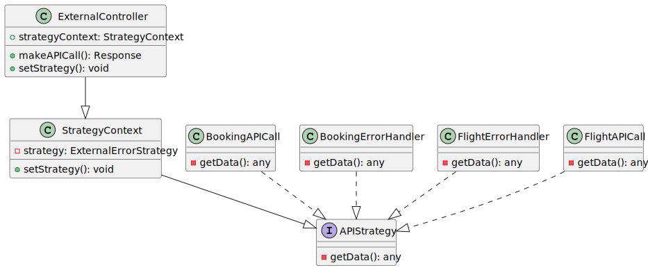
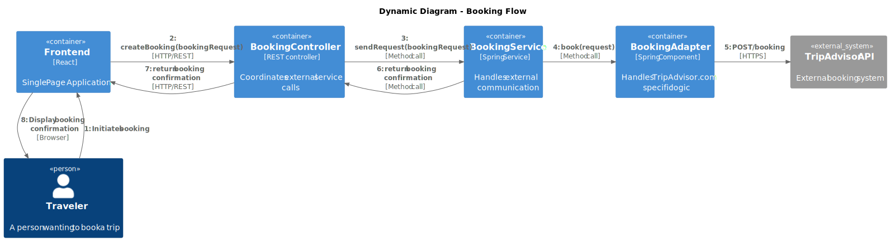

# Software Guidebook Triptop

## 1. Introduction

Dit software guidebook geeft een overzicht van de Triptop-applicatie. Het bevat een samenvatting van het volgende:

1. De vereisten, beperkingen en principes.
1. De software-architectuur, met inbegrip van de technologiekeuzes op hoog niveau en de structuur van de software.
1. De ontwerp- en codebeslissingen die zijn genomen om de software te realiseren.
1. De architectuur van de infrastructuur en hoe de software kan worden geinstalleerd.

## 2. Context

### context diagram

[View context diagram source](context-diagram/context-triptop.svg)

### Functionaliteit

TripTop is een vakantieplanningsapplicatie die is ontworpen om gebruikers volledige controle
te geven over hun reisplanning. Het platform stelt gebruikers in staat om hun vakanties te plannen,
te boeken en te beheren via een geïntegreerde interface. Door verschillende reisdiensten samen te
brengen in één applicatie vereenvoudigt TripTop het proces van reisplanning en biedt het een complete
oplossing voor alle aspecten van vakantieorganisatie.

### Gebruikers

De TripTop applicatie bedient twee belangrijke gebruikersgroepen. De eerste groep bestaat uit reizigers
die op zoek zijn naar een efficiënte manier om hun vakantie te plannen en te boeken.
Deze reizigers waarderen de autonomie en het gemak van een geïntegreerd platform.
De tweede groep bestaat uit reisagenten die hun expertise inzetten om reizigers te ondersteunen
bij het plannen van hun reis. Deze professionals hebben toegang tot uitgebreide functionaliteit
om complexe reisplanningen te beheren en kunnen reizigers adviseren over de beste opties voor
hun specifieke wensen.

### Externe Systemen

Om een complete reisplanning mogelijk te maken, integreert TripTop met een breed scala aan externe diensten.
Voor accommodaties werkt het systeem samen met grote boekingsplatforms zoals Booking.com en TripAdvisor.
Het vervoer wordt geregeld via integraties met transportdiensten zoals NS, Deutsche Bahn en KLM.
Voor lokaal vervoer op de bestemming biedt TripTop toegang tot autoverhuurdiensten zoals Sixt en Hertz.
De reiservaring wordt verrijkt door integratie met activiteitenaanbieders
zoals GetYourGuide en Tripadvisor, terwijl restaurantreserveringen mogelijk zijn via services
als Takeaway en Eet.nu. Voor een veilige gebruikerservaring maakt TripTop gebruik
van betrouwbare identity providers zoals Google, Microsoft en Airbnb, en worden betalingen
verwerkt via gespecialiseerde betalingssystemen.

### Relaties

De kracht van TripTop ligt in de manier waarop het verschillende systemen en gebruikers met elkaar verbindt.
Reizigers hebben direct toegang tot het platform waar ze hun reizen kunnen plannen en boeken.
Het systeem communiceert naadloos met verschillende externe diensten om accommodaties te reserveren, transport te
regelen en activiteiten te boeken. Reisagenten kunnen via het platform complete reispakketten
samenstellen voor hun klanten, waarbij ze gebruik maken van dezelfde geïntegreerde functionaliteit.
De authenticatie verloopt veilig via erkende identity providers, terwijl alle financiële transacties
worden afgehandeld door betrouwbare betalingssystemen. Deze onderlinge verbindingen zorgen ervoor dat
alle aspecten van reisplanning en -boeking soepel op elkaar aansluiten, wat resulteert
in een gebruiksvriendelijke en efficiënte reisplanningservaring.

## 3. Functional Overview

Om de belangrijkste features toe te lichten zijn er user stories en twee domain stories gemaakt en een overzicht van het domein in de vorm van een domeinmodel. Op deze plek staat typisch een user story map maar die ontbreekt in dit voorbeeld.

### 3.1 User Stories

#### 3.1.1 User Story 1: Reis plannen

Als gebruiker wil ik een zelfstandig op basis van diverse variabelen (bouwstenen) een reis kunnen plannen op basis van mijn reisvoorkeuren (wel/niet duurzaam reizen, budget/prijsklasse, 's nachts reizen of overdag etc.) zodat ik op vakantie kan gaan zonder dat hiervoor een reisbureau benodigd is.

#### 3.1.2 User Story 2: Reis boeken

Als gebruiker wil ik een geplande reis als geheel of per variabele (bouwsteen) boeken en betalen zodat ik op vakantie kan gaan zonder dat hiervoor een reisbureau benodigd is.

#### 3.1.3 User Story 3: Reis cancelen

Als gebruiker wil ik een geboekte reis, of delen daarvan, kunnen annuleren zodat ik mijn geld terug kan krijgen zonder inmenging van een intermediair zoals een reisbureau.

#### 3.1.4 User Story 4: Reisstatus bewaren

Als gebruiker wil ik mijn reisstatus kunnen bewaren zonder dat ik een extra account hoef aan te maken zodat ik mijn reis kan volgen zonder dat ik daarvoor extra handelingen moet verrichten.

#### 3.1.5 User Story 5: Bouwstenen flexibel uitbreiden

Als gebruiker wil ik de bouwstenen van mijn reis flexibel kunnen uitbreiden met een zelf te managen stap (bijv. met providers die niet standaard worden aangeboden zoals een andere reisorganisatie, hotelketen etc.) zodat ik mijn reis helemaal kan aanpassen aan mijn wensen.

### 3.2 Domain Story Reis Boeken (AS IS)

### 3.3 Domain Story Reis Boeken (TO BE)

### 3.4 Domain Model

| class: attribute                | is input voor API+endpoint                           | wordt gevuld door API+endpoint                      | wordt geleverd door eindgebruiker | moet worden opgeslagen in de applicatie |
| ------------------------------- | ---------------------------------------------------- | --------------------------------------------------- | --------------------------------- | --------------------------------------- |
| Trip::startDatum                | Booking /search (POST), FlightScraper /flights (GET) |                                                     | x                                 | x                                       |
| Trip::eindDatum                 | Booking /search (POST), FlightScraper /flights (GET) |                                                     | x                                 | x                                       |
| Trip::budget                    |                                                      |                                                     | x                                 | x                                       |
| Excursie::titel                 |                                                      | TripAdvisor /search                                 |                                   | x                                       |
| Excursie::datum                 |                                                      | TripAdvisor /search                                 |                                   | x                                       |
| Excursie::startTijd             |                                                      | TripAdvisor /search                                 |                                   | x                                       |
| Excursie::eindTijd              |                                                      | TripAdvisor /search                                 |                                   | x                                       |
| Excursie::prijs                 |                                                      | TripAdvisor /search                                 |                                   | x                                       |
| Reis::startDatum                | FlightScraper /flights (GET)                         |                                                     | x                                 | x                                       |
| Reis::eindDatum                 | FlightScraper /flights (GET)                         |                                                     | x                                 | x                                       |
| Reis::prijs                     |                                                      | FlightScraper /flights (GET)                        |                                   | x                                       |
| Reis::vervoer                   |                                                      |                                                     | x                                 | x                                       |
| Verblijf::startDatum            | Booking /search (POST)                               |                                                     | x                                 | x                                       |
| Verblijf::eindDatum             | Booking /search (POST)                               |                                                     | x                                 | x                                       |
| Verblijfplaats::locatie         |                                                      | Booking /search (POST)                              |                                   | x                                       |
| Verblijfplaats::prijs           |                                                      | Booking /search (POST)                              |                                   | x                                       |
| Locatie::lat                    |                                                      | Booking /search (POST), TripAdvisor /search         |                                   | x                                       |
| Locatie::lon                    |                                                      | Booking /search (POST), TripAdvisor /search         |                                   | x                                       |
| Reiziger::voornaam              |                                                      |                                                     | x                                 | x                                       |
| Reiziger::achternaam            |                                                      |                                                     | x                                 | x                                       |
| Reiziger::telefoonnummer        |                                                      |                                                     | x                                 | x                                       |
| Reservering::reserveringsnummer |                                                      | Booking /confirm (POST), FlightScraper /book (POST) |                                   | x                                       |
| Reservering::status             |                                                      | Booking /status (GET), FlightScraper /status (GET)  |                                   | x                                       |

## 4. Quality Attributes

Voordat deze casusomschrijving tot stand kwam, heeft de opdrachtgever de volgende ISO 25010 kwaliteitsattributen benoemd als belangrijk:

-   Compatibility -> Interoperability (Degree to which a system, product or component can exchange information with other products and mutually use the information that has been exchanged)
-   Reliability -> Fault Tolerance (Degree to which a system or component operates as intended despite the presence of hardware or software faults)
-   Maintainability -> Modularity (Degree to which a system or computer program is composed of discrete components such that a change to one component has minimal impact on other components)
-   Maintainability -> Modifiability (Degree to which a product or system can be effectively and efficiently modified without introducing defects or degrading existing product quality)
-   Security -> Integrity (Degree to which a system, product or component ensures that the state of its system and data are protected from unauthorized modification or deletion either by malicious action or computer error)
-   Security -> Confidentiality (Degree to which a system, product or component ensures that data are accessible only to those authorized to have access)

## 5. Constraints

> [!IMPORTANT]
> Beschrijf zelf de beperkingen die op voorhand bekend zijn die invloed hebben op keuzes die wel of niet gemaakt kunnen of mogen worden.

## 6. Principles

In softwareontwikkeling is het belangrijk om een duidelijke en gestructureerde codebase te behouden. Dit zorgt niet alleen voor betere onderhoudbaarheid en schaalbaarheid, maar ook voor een efficiëntere samenwerking binnen het team. In dit hoofdstuk bespreken we twee fundamentele principes die bijdragen aan goed gestructureerde software: het Single Responsibility Principle (SRP) en Separation of Concerns (SoC). Door deze principes toe te passen, zorgen we ervoor dat onze code overzichtelijk, flexibel en robuust blijft.

### Single Responsibility Principle (SRP)

Het Single Responsibility Principle stelt dat een klasse slechts één duidelijke verantwoordelijkheid moet hebben. Dit betekent dat elke klasse slechts één reden mag hebben om te veranderen. Door dit principe toe te passen, voorkomen we dat een klasse te veel verschillende taken uitvoert, wat de code complex en moeilijk te onderhouden maakt.

Voorbeelden van SRP in onze codebase:

HotelService: Verantwoordelijk voor alle hotelgerelateerde operaties, zoals het ophalen van hotelgegevens en het verwerken van reserveringen.

TransportService: Verantwoordelijk voor transportgerelateerde operaties, zoals het regelen van vervoer voor een reis.

ApiConfig: Verantwoordelijk voor de configuratie van de API, zoals authenticatie en verbindingen met externe services.

TripController: Verantwoordelijk voor het afhandelen van HTTP-verzoeken met betrekking tot reizen.

Door deze scheiding zorgen we ervoor dat elke klasse een duidelijke focus heeft, wat leidt tot betere testbaarheid en herbruikbaarheid van code.

### Separation of Concerns (SoC)

Het Separation of Concerns-principe benadrukt het belang van het opdelen van software in aparte onderdelen met elk een eigen verantwoordelijkheid. Dit voorkomt dat verschillende lagen van de applicatie in elkaar overlopen, wat kan leiden tot een onoverzichtelijke codebase.

Een duidelijke scheiding in onze architectuur:

API-configuratie: Wordt beheerd door ApiConfig, waarin alle instellingen en connecties met externe systemen worden vastgelegd.

Business logic: Behandeld door services zoals HotelService en TransportService, waarin de kernfunctionaliteit van de applicatie wordt geïmplementeerd.

HTTP endpoints: Gehandeld door controllers, zoals TripController, die verantwoordelijk is voor het verwerken van inkomende verzoeken en het aanroepen van de juiste services.

Data modellen: Worden gebruikt om de structuur van gegevens te definiëren en om dataoverdracht binnen de applicatie mogelijk te maken.

Door Separation of Concerns strikt toe te passen, zorgen we ervoor dat wijzigingen in één onderdeel van de applicatie minimale impact hebben op de rest van het systeem. Dit maakt het makkelijker om nieuwe functionaliteiten toe te voegen en bestaande code te onderhouden.

### Open/Closed Principle (OCP)

Het Open/Closed Principle stelt dat software-entiteiten (klassen, modules, functies, etc.) open moeten staan voor uitbreiding, maar gesloten voor modificatie. Dit betekent dat we bestaande code niet moeten wijzigen om nieuwe functionaliteit toe te voegen, maar in plaats daarvan nieuwe code moeten toevoegen die de bestaande code uitbreidt.

Voorbeelden van OCP in onze codebase:

Adapter Interfaces: De `HotelAdapter` en `TransportAdapter` interfaces zijn open voor uitbreiding door nieuwe implementaties toe te voegen, zonder dat de bestaande code hoeft te worden gewijzigd.

Service Interfaces: De `IExternalService` interface maakt het mogelijk om nieuwe services toe te voegen zonder de bestaande service-implementaties te wijzigen.

Controller Endpoints: Onze controllers zijn ontworpen om nieuwe endpoints toe te voegen zonder bestaande endpoints te wijzigen.

Door het Open/Closed Principle toe te passen, zorgen we ervoor dat onze codebase flexibel en uitbreidbaar blijft, terwijl we het risico op het introduceren van bugs in bestaande functionaliteit minimaliseren. Dit maakt het mogelijk om nieuwe features toe te voegen zonder de stabiliteit van het systeem in gevaar te brengen.

## 7. Software Architecture

### 7.1. Containers

[View container diagram source](container-diagram/container-triptop.svg)

Het container diagram geeft een gedetailleerd inzicht in de interne architectuur van de TripTop applicatie en hoe verschillende onderdelen met elkaar communiceren.
De architectuur is opgezet met een focus op schaalbaarheid, veiligheid en gebruiksgemak.

### Architectuur Componenten

De kern van TripTop bestaat uit twee client-side applicaties: een web-applicatie ontwikkeld in React en een mobiele applicatie gebouwd met React Native.
Deze frontend-applicaties bieden reizigers en reisagenten een intuïtieve interface voor het plannen en beheren van reizen.

De backend is ontwikkeld met Java en Spring Boot, een krachtige combinatie die zorgt voor betrouwbare server-side functionaliteit.
Deze laag handelt alle cruciale operaties af, waaronder API-routing, authenticatie, bedrijfslogica en externe service-integraties.
Door deze functionaliteit in de backend te plaatsen, vooral de communicatie met externe services, waarborgen we de veiligheid van gevoelige gegevens zoals API-keys.

Voor dataopslag maakt TripTop gebruik van twee MongoDB databases. De Trip Database is specifiek ontworpen voor het opslaan van
reisplannen en gerelateerde componenten, terwijl de User Database zich richt op het beheren van gebruikersgegevens en voorkeuren.
MongoDB's documentgeoriënteerde structuur biedt de flexibiliteit die nodig is voor het opslaan van complexe reisgegevens.

### Communicatie en Interacties

De communicatie tussen componenten verloopt via zorgvuldig gedefinieerde patronen. Reizigers en reisagenten interacteren met het
systeem via HTTPS-verbindingen met de web- en mobiele applicaties. Deze frontends communiceren op hun beurt met de backend via JSON/HTTPS,
waarbij alle verzoeken voor reisplanning en boekingen worden afgehandeld.

De backend vormt het centrale punt voor alle externe communicatie. Het systeem integreert met diverse externe services:

-   Authenticatie verloopt via bekende identity providers zoals Google en Microsoft, gebruikmakend van OAuth/HTTPS
-   Betalingen worden veilig verwerkt door gespecialiseerde payment systems
-   Reisdiensten zoals accommodaties (via TripAdvisor), transport (via providers als NS en KLM), autoverhuur (via bedrijven als Sixt),
    activiteiten (via platforms als GetYourGuide) en restaurantboekingen worden allemaal geïntegreerd via REST/HTTPS-verbindingen

De backend communiceert met beide databases via de MongoDB Driver, waarbij reisgegevens en gebruikersinformatie gescheiden worden
opgeslagen voor optimale beveiliging en prestaties.

### Veiligheid en Schaalbaarheid

De architectuur is ontworpen met veiligheid als prioriteit. Gevoelige operaties en gegevens worden afgehandeld in de backend,
waar ze beschermd zijn tegen ongeautoriseerde toegang. De scheiding tussen frontend en backend, en het gebruik van moderne
authenticatie- en communicatieprotocollen, zorgt voor een robuuste beveiligingsarchitectuur.

Deze containerarchitectuur biedt niet alleen een veilige maar ook een schaalbare oplossing die kan meegroeien met de behoeften
van de applicatie. De modulaire opzet maakt het mogelijk om individuele componenten te upgraden of te vervangen zonder het hele systeem te beïnvloeden.

### 7.2. Components

### databases

[View database component diagram source](component-diagram/database-component-diagram-triptop.svg)

Het database component diagram geeft een gedetailleerd overzicht van de interne structuur van de database componenten van TripTop.
Het toont de belangrijkste componenten binnen de databases en hun interacties. De keuze voor twee gescheiden
databases is een bewuste architectuurbeslissing die voortkomt uit security-overwegingen en de verschillende
karakteristieken van de opgeslagen data (zie ADR-002 voor de volledige onderbouwing).

### Trip Database Layer

De Trip Database vormt het hart van de reisgegevensopslag binnen TripTop. Deze MongoDB database is specifiek
ontworpen voor het beheren van alle reisgerelateerde informatie. De database bestaat uit twee hoofdcollecties die nauw met elkaar samenwerken.
De Trip Collection fungeert als centrale opslagplaats voor reisplannen en hun configuraties, terwijl de
Booking Collection zich richt op het vastleggen van boekingsgegevens en hun actuele status. Deze collecties
zijn met elkaar verbonden via een interne relatie, waardoor er een duidelijk verband bestaat tussen reisplannen en hun bijbehorende boekingen.

### User Database Layer

De User Database is opgezet als een gescheiden MongoDB database die zich volledig richt op het beheer van gebruikersgerelateerde informatie.
Deze scheiding van de Trip Database is cruciaal voor de beveiliging van gevoelige gebruikersgegevens.
Door persoonlijke en authenticatie-informatie in een aparte database op te slaan, kunnen we strengere
beveiligingsmaatregelen en toegangscontroles implementeren voor deze gevoelige data.
De database bestaat uit meerdere gespecialiseerde collecties die samen een compleet gebruikersprofiel vormen.
De User Collection bevat de kerngegevens van gebruikersprofielen en hun persoonlijke voorkeuren.
De Auth Collection is verantwoordelijk voor het veilig opslaan van authenticatiegegevens,
terwijl de Saved Trip Collection fungeert als persoonlijke bibliotheek waar gebruikers hun opgeslagen reizen kunnen terugvinden.
Deze collecties zijn onderling verbonden, waarbij de User Collection direct gekoppeld is aan zowel
de Auth Collection als de Saved Trip Collection, wat een geïntegreerde gebruikerservaring mogelijk maakt.

### Externe Relaties

De communicatie met beide databases verloopt via een gecentraliseerd toegangspunt.
De API Gateway fungeert als de primaire interface voor alle databaseinteracties,
waarbij zowel de Trip Database als de User Database verzoeken ontvangen en verwerken via dit kanaal.
Deze architectuur zorgt voor een gecontroleerde en veilige toegang tot de opgeslagen gegevens,
waarbij de integriteit van de data gewaarborgd blijft. De gescheiden databases maken het mogelijk om
verschillende beveiligingsniveaus en toegangscontroles te implementeren, waarbij de User Database
strengere encryptie en toegangsrestricties kent dan de Trip Database. Dit past bij het principe van
defense in depth, waarbij gevoelige gebruikersgegevens extra beschermd worden tegen ongeautoriseerde toegang.

### Beveiligingsvoordelen van Gescheiden Databases

De keuze voor gescheiden databases biedt verschillende belangrijke beveiligingsvoordelen.
Allereerst zorgt deze architectuur voor een strikte isolatie tussen gevoelige gebruikersgegevens
en algemene reisgegevens, wat een fundamentele beveiligingslaag toevoegt aan het systeem.
Door deze scheiding kunnen we verschillende beveiligingsniveaus implementeren voor elke database,
waarbij de gebruikersdatabase strenger beveiligd kan worden dan de reisdatabase.

Deze aanpak beperkt ook de potentiële impact van een beveiligingsinbreuk. Als één database gecompromitteerd zou worden,
blijft de andere database veilig, wat het risico op grootschalig dataverlies of -diefstal significant vermindert.
Daarnaast biedt deze structuur meer flexibiliteit in het beheer van de databases. We kunnen verschillende
backup- en recovery-strategieën toepassen die zijn afgestemd op de specifieke behoeften en gevoeligheid van de data in elke database.

De gescheiden architectuur maakt het ook mogelijk om verschillende schalings- en performanceoptimalisaties toe
te passen op basis van het specifieke gebruikspatroon van elke database. Zo kan de reisdatabase geoptimaliseerd
worden voor snelle leesoperaties, terwijl de gebruikersdatabase kan worden afgestemd op veilige schrijfoperaties en strikte toegangscontrole.

Voor een gedetailleerde onderbouwing van deze architectuurkeuze, zie [ADR-002 "Use of Two Databases for Security Reasons"](#82-adr-002-use-of-two-databases-for-security-reasons).

### backend

[View backend component diagram source](component-diagram/backend-component-diagram-triptop.svg)

Het backend component diagram geeft een gedetailleerd overzicht van de interne structuur van de TripTop backend services.
Deze architectuur is ontworpen om alle server-side functionaliteit efficiënt en veilig af te handelen.

### Externe Systemen

De backend integreert met een breed scala aan externe systemen om complete reisfunctionaliteit te bieden.
Voor gebruikersauthenticatie maakt het systeem gebruik van betrouwbare identity providers zoals Google, Microsoft en Airbnb.
Financiële transacties worden afgehandeld door gespecialiseerde payment systems. Voor reisdiensten integreert de backend met
diverse services: accommodatieboekingen via platforms als Booking.com en TripAdvisor, transportreserveringen via providers als NS,
Deutsche Bahn en KLM, autoverhuur via diensten als Sixt en Hertz, activiteitenboekingen via GetYourGuide en Tripadvisor,
en restaurantreserveringen via services als Takeaway en Eet.nu.

### Backend Services

De backend is gestructureerd rond verschillende gespecialiseerde services, elk met hun eigen verantwoordelijkheden.
Centraal staat de API Gateway die alle inkomende verzoeken routeert naar de juiste service componenten. Het authenticatiesysteem,
bestaand uit de Auth Controller, Auth Service en Auth Repository, zorgt voor veilige gebruikerstoegang en sessiebeheer.

De kernfunctionaliteit wordt geleverd door verschillende gespecialiseerde modules. De Trip-gerelateerde
componenten (Controller, Service, Repository) beheren alle aspecten van reisplanning. De Booking-componenten
verzorgen het reserveringsproces, terwijl de Payment-componenten zich richten op financiële transacties.
De Integration-componenten faciliteren de communicatie met externe services, en de User-componenten beheren gebruikersgegevens en -voorkeuren.

### Database Integratie

De backend werkt nauw samen met twee centrale databases. De Trip Database fungeert als opslagplaats voor
alle reisplannen en gerelateerde bouwstenen, terwijl de User Database zich richt op het beheer van
gebruikersgegevens en -voorkeuren. Deze scheiding zorgt voor optimale data-organisatie en verbeterde beveiliging.

### Service Interacties

De interactie tussen verschillende componenten volgt een duidelijk patroon. De API Gateway dirigeert inkomende
verzoeken naar de juiste controllers, die op hun beurt de bijbehorende services aanroepen. Deze services maken
gebruik van repositories voor data-toegang en -persistentie. De Booking en Payment services werken samen met de
Integration service voor externe communicatie, wat zorgt voor een gestroomlijnde interactie met externe dienstverleners.

De Booking Service speelt een centrale rol in het coördineren van verschillende externe boekingen, of het nu
gaat om accommodaties, transport, autoverhuur, activiteiten of restaurantreserveringen. De Auth Service beheert
alle authenticatieprocessen met externe identity providers, terwijl de Payment Service zorgt voor veilige
verwerking van financiële transacties via gespecialiseerde betalingssystemen.

Deze gelaagde architectuur, met duidelijk gedefinieerde verantwoordelijkheden en communicatiepatronen,
zorgt voor een robuust en onderhoudbaar systeem dat effectief kan schalen en evolueren met de behoeften van de applicatie.

### frontend

[View frontend component diagram source](component-diagram/frontend-component-diagram-triptop.svg)

Het frontend component diagram geeft een gedetailleerd overzicht van de interne structuur van
de TripTop frontend applicaties. Het systeem bedient twee primaire gebruikersgroepen: de reiziger (Traveler)
die de applicatie gebruikt voor het boeken van reizen en beheren van boekingen, en de reisagent (Travel Agent)
die als professional aangepaste reisplannen maakt en klanten ondersteunt bij hun reisbehoeften.

### Web Application Layer

De webapplicatie vormt een cruciale interface voor beide gebruikersgroepen.
In het hart van deze laag bevindt zich de Auth Manager, die verantwoordelijk is voor het beheren
van gebruikersauthenticatie en het waarborgen van een veilige gebruikerssessie. De Router zorgt
voor naadloze navigatie tussen verschillende delen van de applicatie, terwijl de State Manager,
geïmplementeerd met Redux, een consistente en voorspelbare toestand van de applicatie garandeert.

De gebruikersinterface is opgebouwd uit verschillende gespecialiseerde componenten.
De UI Components vormen samen de visuele structuur van de applicatie, waarbij elk component
is ontworpen voor optimale gebruikerservaring. Het Trip Planner component dient als centrale hub
voor reisplanning, waar gebruikers hun reizen kunnen samenstellen en aanpassen. Het Booking
Manager component faciliteert het volledige boekingsproces, terwijl de Payment Processor zorgt
voor veilige en efficiënte betalingsverwerking.

### Mobile Application Layer

De mobiele applicatie spiegelt de functionaliteit van de webapplicatie, maar is specifiek geoptimaliseerd
voor gebruik op mobiele apparaten. Ook hier vormt de Auth Manager de basis voor veilige toegang,
terwijl de Router zorgt voor intuïtieve navigatie binnen de app. De State Manager, eveneens gebouwd
met Redux, zorgt voor consistente datastromen en gebruikerservaringen op mobiele platforms.

De mobiele UI Components zijn speciaal ontworpen voor touchscreen-interactie en verschillende schermformaten.
Het Trip Planner component biedt dezelfde uitgebreide reisplanningsfunctionaliteit als de webversie,
maar met een aangepaste interface voor mobiel gebruik. De Booking Manager en Payment Processor zijn
geoptimaliseerd voor snelle en veilige transacties onderweg.

### Externe Systemen

Beide applicatielagen communiceren met de backend via een centrale API Gateway.
Deze gateway fungeert als unified entry point voor alle interacties tussen de frontend applicaties en de backend services.
Dit zorgt voor een gestroomlijnde en beveiligde communicatie, waarbij alle verzoeken en responses consistent worden afgehandeld.

Deze architectuur zorgt ervoor dat gebruikers, of ze nu via web of mobiel toegang hebben,
kunnen rekenen op een consistente, veilige en gebruiksvriendelijke ervaring bij het plannen en boeken van hun reizen.

### 7.3. Design & Code

### facade

#### Ontwerpvraag

"Wie roept een specifieke externe service aan, gebeurt dat vanuit de front-end of vanuit de back-end? Welke redenen zijn er om voor de ene of de andere aanpak te kiezen?"

#### Toelichting op de Facade Pattern

Om de complexiteit van directe communicatie tussen de front-end en externe services te verminderen, heb ik gekozen voor het Facade design pattern. Dit patroon biedt een vereenvoudigde interface voor een complex subsysteem van services, waardoor de front-end alleen met de facade hoeft te communiceren in plaats van met elke individuele service.

Dit maakt de architectuur overzichtelijker en vermindert de afhankelijkheid van de front-end van specifieke implementatiedetails van de externe services. De facade coördineert ook de interacties tussen verschillende services, wat het onderhoud en de uitbreiding van het systeem vergemakkelijkt.

Wij hebben in het klassen-diagram dat hieronder te zien is ervoor gekozen om de services via de backend aan te roepen. Dit zijn de redenen waarom we dit hebben gedaan:

#### Security Voordelen:

API keys en credentials worden veilig in de backend bewaard.  
Centrale authenticatie via SecurityManager.  
Geen gevoelige data exposure in de frontend.  

#### Performance Optimalisatie:

Centrale caching via ResponseCache.  
Rate limiting controle via RateLimiter.  
Efficiënt hergebruik van responses.  

#### Error Management:

Gecentraliseerde error handling.  
Consistent retry mechanisme.  
Uniforme error responses.  

#### Onderhoud & Flexibiliteit:

Eenvoudig nieuwe services toevoegen.
Frontend onafhankelijk van externe services.
Centrale plek voor monitoring en logging.

#### class diagram

Het Facade patroon is geïmplementeerd om een vereenvoudigde interface te bieden voor een complex subsysteem van services. In dit diagram:

-   `TripFacade` fungeert als de hoofdinterface voor clients, waarbij de complexiteit van de onderliggende services wordt verborgen
-   `HotelService`, `TransportService` en `ExcursionService` zijn de subsysteemcomponenten die specifieke aspecten van reisplanning afhandelen
-   De facade coördineert deze services en biedt een uniforme interface voor reisgerelateerde operaties
-   Dit patroon helpt de koppeling tussen clients en het subsysteem te verminderen, waardoor het systeem beter onderhoudbaar en gebruiksvriendelijker wordt

#### sequence diagram

Het sequentiediagram illustreert hoe het Facade patroon een reisplanning verzoek afhandelt:

1. De client communiceert alleen met de `TripFacade`, die fungeert als enig contactpunt
2. De facade coördineert de benodigde operaties over meerdere services
3. Elke service (`HotelService`, `TransportService`, `ExcursionService`) handelt zijn specifieke domein af
4. De facade combineert de resultaten en retourneert een uniform antwoord aan de client
5. Deze flow toont aan hoe de facade complexe interacties vereenvoudigt terwijl de scheiding van verantwoordelijkheden behouden blijft

Door het gebruik van het Facade design pattern wordt de front-end ontlast van de directe communicatie met externe services, wat leidt tot een veiliger, beter presterend en onderhoudbaar systeem.

### Adapter

#### class diagram

Het Adapter patroon is geïmplementeerd om incompatibele interfaces tussen ons systeem en externe services te overbruggen:

-   `IExternalService` definieert de interface die ons systeem verwacht
-   `HotelAdapter` en `TransportAdapter` implementeren deze interface en passen de interfaces van externe services aan
-   De adapters vertalen verzoeken en antwoorden tussen het formaat van ons systeem en de formaten van externe services
-   Dit patroon stelt ons in staat om te integreren met verschillende externe services zonder ons kernsysteem te wijzigen

#### sequence diagram

Het sequentiediagram toont hoe het Adapter patroon de communicatie met externe services afhandelt:

1. De client doet een verzoek via de interface van ons systeem
2. De adapter ontvangt het verzoek en vertaalt het naar het formaat dat de externe service verwacht
3. De externe service verwerkt het verzoek en retourneert een antwoord
4. De adapter vertaalt het antwoord terug naar het formaat van ons systeem
5. Dit proces zorgt voor naadloze integratie tussen ons systeem en externe services met verschillende interfaces

### Strategy

#### Class Diagram

De strategy zorgt er voor dat het heel simpel is om meer api calls en bijhoorende error responses aan te maken.
Hierbij heeft een service of controller; in dit geval de ExternalController een instantie van StrategyContext.
Deze StrategyContext heeft een instantie van de interface APIStrategy. Deze kan (her)geinitialiseerd worden met een van de implementaties van deze interface via de setStrategy van StrategyContext.
De data dat gereturneerd wordt bij getData is per implementatie van APIStrategy anders. Wanneer dan getData wordt aangeroepen, krijgt de StrategyContext de juiste data terug.

#### Sequence Diagram

Hierboven staat de werking van de strategy stappengewijs uitgelegd. Hierin wordt Booking gebruikt als voorbeeld externe API.  
Er staan hierin 2 scenario's: indien de API werkend is; en waneer de API niet werkend is. 
Bij de scenatio waar het wel werkend is, wordt eerst de juiste strategy (BookingAPICall) toegepast. Daarna wordt hiermee een API call gedaan naar Booking om de data op te halen. 
Deze call wordt hier dan goed uitgevoerd en de data returned. 
Indien het niet werkend is, wordt aan het begin ook de BookingAPICall strategy toegepast. Bij het uitvoeren van deze API call komt er een error. 
Dan wordt de andere strategy toegepast. Deze strategy returnt dan backup-data of een error message.

#### sequence diagram

### dynamic diagrams

## 8. Architectural Decision Records

### 8.1. ADR-001 Integration with TripAdvisor API for Accommodation Search

Date: 2024-03-21

## Status

Accepted

## Context

De Triptop-applicatie moet accommodatiezoekfunctionaliteit bieden zodat gebruikers hotels kunnen vinden en boeken als onderdeel van hun reisplanning. In plaats van onze eigen accommodatiedatabase te bouwen en te onderhouden, moeten we integreren met een bestaande service die uitgebreide en actuele accommodatiegegevens biedt.

Enkele belangrijke vereisten zijn toegang tot een grote database van accommodaties wereldwijd, de mogelijkheid om te zoeken op locatie, data en andere filters, en gedetailleerde informatie over elke accommodatie, inclusief foto's, prijzen en recensies. Daarnaast is ondersteuning voor verschillende talen en valuta's nodig.

## Considered Options

| Force                         | TripAdvisor API | Expedia API | Hotels.com API | Airbnb API |
| ----------------------------- | --------------- | ----------- | -------------- | ---------- |
| **Data Completeness**         | ++              | +           | +              | 0          |
| **Global Coverage**           | ++              | +           | +              | 0          |
| **Development Effort**        | +               | 0           | 0              | -          |
| **Integration Complexity**    | +               | 0           | 0              | -          |
| **Maintenance Burden**        | +               | +           | +              | +          |
| **Update Frequency**          | ++              | +           | +              | +          |
| **API Stability**             | +               | 0           | 0              | -          |
| **Variety of Accommodations** | +               | +           | 0              | ++         |
| **Documentation Quality**     | ++              | +           | 0              | -          |
| **Multi-language Support**    | ++              | +           | +              | 0          |

Legend:

-   ++ : Excellent fit / Strong advantage
-   -   : Good fit / Advantage
-   0 : Neutral / Average
-   -   : Poor fit / Disadvantage
-   -- : Very poor fit / Strong disadvantage

## Decision

We zullen integreren met de TripAdvisor API via RapidAPI om accommodatiezoekfunctionaliteit te bieden. De integratie zal bestaan uit:

1. Een client-side wrapper (`BookingApiClient`) die API-verzoeken en responsemapping afhandelt
2. Uitbreiding van ons domeinmodel om aan de TripAdvisor API-vereisten te voldoen
3. Mapping tussen ons domeinmodel en de TripAdvisor API-datastructuren

## Consequences

### Positive

Toegang tot een uitgebreide, actuele database van accommodaties wereldwijd is een voordeel. De gegevens worden professioneel beheerd met regelmatige updates. Er is ook minder ontwikkelings- en onderhoudsinspanning in vergelijking met het onderhouden van onze eigen accommodatiedatabase. Bovendien profiteert de applicatie van een gestandaardiseerde interface voor accommodatiezoeken in verschillende delen van het systeem.

### Negative

Er is echter een afhankelijkheid van een externe service, die kan veranderen of onbeschikbaar kan worden. Mogelijke kosten verbonden aan API-gebruik kunnen ontstaan naarmate de applicatie schaalt. Het domeinmodel zou ook moeten worden aangepast aan de API-vereisten. Ten slotte is er beperkte controle over de beschikbare gegevens en functies.

### 8.2. ADR-002 Use of Two Databases for Security Reasons

## Status

Accepted

## Context

De reisapplicatie moet gevoelige gegevens verwerken, inclusief persoonlijke informatie, betalingsgegevens en reisroutes. Om de beveiliging te verbeteren en het risico bij een inbreuk te minimaliseren, overwegen we het gebruik van twee aparte databases. Eén zal algemene applicatiegegevens opslaan en de andere zal gevoelige gegevens opslaan. Deze aanpak is gericht op het isoleren van de gevoelige gegevens om een extra beveiligingslaag toe te voegen.

## Considered Options

| Option                     | Single Database | Two Separate Databases |
| -------------------------- | --------------- | ---------------------- |
| **Operational Complexity** | +               | -                      |
| **Security**               | -               | ++                     |
| **Scalability**            | +               | +                      |
| **Maintainability**        | 0               | -                      |

Legend:

-   ++ : Excellent fit / Strong advantage
-   -   : Good fit / Advantage
-   0 : Neutral / Average
-   -   : Poor fit / Disadvantage
-   -- : Very poor fit / Strong disadvantage

## Decision

We zullen twee databases implementeren:
De eerste database zal niet-gevoelige gebruikersgegevens opslaan, zoals gebruikersvoorkeuren, algemene reisinformatie en niet-gevoelige logs. De tweede database zal gevoelige informatie opslaan zoals persoonlijke gegevens, betalingsgegevens, reisdocumenten en andere hoogrisicogegevens. Door deze twee soorten gegevens te scheiden, kunnen we meer gedetailleerde beveiligingscontroles implementeren op de gevoelige database, de algehele beveiligingspositie van de applicatie verbeteren door de toegang tot gevoelige gegevens te beperken, en strengere encryptiebeleid toepassen voor de gevoelige database.

Voor de gevoelige database zal encryptie in rust worden afgedwongen met behulp van sterke encryptie-algoritmen, zal toegangscontrole nauwkeurig worden afgesteld en zal gegevensmaskering worden toegepast waar nodig. Voor de niet-gevoelige database zal de encryptie minder streng zijn, maar zal de toegang nog steeds beperkt zijn.

## Consequences

Het beheren van twee databases zal extra operationele complexiteit introduceren, inclusief databasesynchronisatie, backupbeheer en onderhoudsoverhead. Er kunnen ook prestatie-effecten zijn door de noodzaak om gegevens over twee databases te benaderen, wat latentie kan introduceren. Met zorgvuldig ontwerp en optimalisatie kunnen deze effecten echter worden geminimaliseerd.

Door gevoelige gegevens te isoleren in een aparte database, minimaliseren we het risico op blootstelling in geval van een database-inbreuk. Als een aanvaller de niet-gevoelige database compromitteert, hebben ze nog steeds geen toegang tot de gevoelige gegevens. Het onderhouden van twee databases kan echter extra kosten met zich meebrengen gerelateerd aan infrastructuur, backup en gegevenssynchronisatie.

## Alternatives Considered

Een overwogen alternatief was het gebruik van een enkele database voor alle gegevens, met strengere toegangscontrole en encryptie. Hoewel dit de architectuur zou vereenvoudigen, zou het alle gegevens blootstellen aan hogere risico's als de database wordt gecompromitteerd. Een ander alternatief was databasesharding, waarbij meerdere shards zouden worden gebruikt voor schaalbaarheid terwijl alle gegevens in dezelfde database blijven. Dit zou echter niet hetzelfde niveau van isolatie en beveiliging bieden voor gevoelige gegevens als twee aparte databases.

## Conclusion

Gezien de behoefte aan verhoogde beveiliging, is het isoleren van gevoelige gegevens in een aparte database de beste optie. Deze aanpak maakt meer gecontroleerde toegang, verhoogde encryptie en een sterker algeheel beveiligingsmodel mogelijk, terwijl de toegevoegde complexiteit en prestatieoverwegingen in balans worden gehouden.

### 8.3. ADR-003: State Management

## Status

Accepted

## Context

De TripTop-applicatie vereist robuust state management om complexe gebruikersinteracties, boekingsprocessen en real-time updates over zowel web- als mobiele platforms te kunnen verwerken. We hebben een oplossing nodig die efficiënt de applicatiestatus kan beheren, neveneffecten kan afhandelen en consistentie kan behouden over verschillende componenten.

## Considered Options

| Option                   | Redux | Context API | MobX |
| ------------------------ | ----- | ----------- | ---- |
| **Scalability**          | ++    | +           | +    |
| **Learning Curve**       | -     | ++          | -    |
| **Developer Experience** | +     | +           | +    |
| **Community Support**    | ++    | +           | +    |
| **Integration**          | ++    | +           | +    |

Legend:

-   ++ : Excellent fit / Strong advantage
-   -   : Good fit / Advantage
-   0 : Neutral / Average
-   -   : Poor fit / Disadvantage
-   -- : Very poor fit / Strong disadvantage

## Decision

We zullen Redux implementeren als onze state management-oplossing voor zowel de web- als mobiele applicaties. Redux biedt een voorspelbare state container die ons zal helpen de status van de applicatie in een gecentraliseerde store te beheren. Dit omvat het beheren van authenticatiestatus, boekingsinformatie, reisplanninggegevens en betalingsverwerkingsstatussen.

De beslissing om Redux te gebruiken is gebaseerd op verschillende belangrijke factoren. Redux biedt gecentraliseerd state management dat ons in staat stelt een enkele bron van waarheid te behouden voor onze applicatiestatus. De voorspelbare statusupdates via reducers zorgen ervoor dat statuswijzigingen consistent worden afgehandeld en gemakkelijk te debuggen zijn. Het sterke ecosysteem en community support betekent dat we toegang hebben tot een schat aan bronnen, middleware en tools. Redux's uitstekende integratie met React en React Native maakt het een natuurlijke keuze voor onze tech stack, terwijl de ingebouwde ontwikkelaarstools krachtige debugmogelijkheden bieden.

## Consequences

Het gebruik van Redux zal verschillende significante voordelen bieden aan onze applicatie. De voorspelbare statusupdates en debugmogelijkheden zullen het gemakkelijker maken om problemen in onze applicatie op te sporen en op te lossen. Het gecentraliseerde state management over componenten zal helpen consistentie te behouden en de complexiteit van statussynchronisatie te verminderen. Deze aanpak zal leiden tot betere codeorganisatie en onderhoudbaarheid, wat het voor ons team gemakkelijker maakt om aan de codebase te werken. De verbeterde ontwikkelaarservaring met Redux DevTools zal onze ontwikkelworkflow verder verbeteren.

Het implementeren van Redux introduceert echter ook bepaalde uitdagingen. De extra boilerplate-code die nodig is voor actions en reducers kan eenvoudige statuswijzigingen onnodig complex maken. Nieuwe ontwikkelaars zullen Redux's concepten en patronen moeten leren, wat de initiële ontwikkeling kan vertragen. Er is ook het risico van over-engineering voor eenvoudige statuswijzigingen, en we zullen onze statusstructuur zorgvuldig moeten plannen om onnodige complexiteit te voorkomen.

## Alternatives Considered

We hebben verschillende alternatieven zorgvuldig geëvalueerd voordat we voor Redux kozen. De React Context API werd overwogen vanwege zijn eenvoud en ingebouwde aard, maar mist de robuuste state management-functies die nodig zijn voor onze complexe applicatie. MobX was een andere optie die goede state management-mogelijkheden biedt, maar heeft een steilere leercurve en minder community support in vergelijking met Redux.

## Conclusion

Redux is de optimale keuze voor onze state management-behoeften, die de juiste balans biedt tussen functies, community support en integratiemogelijkheden voor zowel onze web- als mobiele applicaties. Hoewel het enige complexiteit introduceert, wegen de voordelen van voorspelbaar state management, sterk ecosysteem support en uitstekende ontwikkelaarstools op tegen de initiële leercurve en extra boilerplate-code.

### 8.4. ADR-004: Database Type

## Status

Accepted

## Context

De TripTop-applicatie vereist een flexibele en schaalbare database-oplossing die verschillende soorten gegevens kan verwerken, inclusief gebruikersprofielen, reisinformatie, boekingen en authenticatiegegevens. De datastructuur kan in de loop van de tijd evolueren naarmate we nieuwe functies en vereisten toevoegen. We hebben een database nodig die zowel gestructureerde als semi-gestructureerde gegevens efficiënt kan verwerken terwijl goede prestaties en schaalbaarheid worden behouden.

## Considered Options

| Option                 | MongoDB | PostgreSQL | MySQL | CouchDB |
| ---------------------- | ------- | ---------- | ----- | ------- |
| **Schema Flexibility** | ++      | -          | -     | ++      |
| **Scalability**        | ++      | +          | +     | +       |
| **Query Performance**  | +       | ++         | +     | -       |
| **Data Consistency**   | -       | ++         | ++    | -       |
| **Development Speed**  | ++      | +          | +     | +       |
| **Offline Support**    | -       | -          | -     | ++      |
| **Community Size**     | ++      | ++         | ++    | -       |

Legend:

-   ++ : Excellent fit / Strong advantage
-   -   : Good fit / Advantage
-   0 : Neutral / Average
-   -   : Poor fit / Disadvantage
-   -- : Very poor fit / Strong disadvantage

## Decision

We zullen MongoDB implementeren als onze primaire database-oplossing voor zowel de reis- als gebruikersdatabases. MongoDB's document-gebaseerde architectuur sluit perfect aan bij onze behoeften, waardoor we gegevens kunnen opslaan in flexibele, JSON-achtige documenten. Deze structuur is bijzonder goed geschikt voor ons reisplanning- en boekingssysteem, waar datastructuren kunnen variëren en evolueren in de loop van de tijd.

De beslissing om MongoDB te gebruiken is gebaseerd op verschillende belangrijke factoren. MongoDB's schema-loze ontwerp biedt de flexibiliteit die we nodig hebben om onze datamodellen aan te passen naarmate de applicatie evolueert. De document-gebaseerde structuur vertegenwoordigt natuurlijk onze reis- en gebruikersgegevens, waardoor het gemakkelijker wordt om complexe relaties te modelleren. MongoDB's horizontale schaalbaarheidsmogelijkheden via sharding zullen ons in staat stellen onze applicatie te schalen naarmate onze gebruikersbasis groeit. De rijke querytaal en aggregatieframework zullen ons in staat stellen complexe queries en data-analyse efficiënt uit te voeren.

## Consequences

Het gebruik van MongoDB zal verschillende significante voordelen bieden aan onze applicatie. Het flexibele schema-ontwerp zal het gemakkelijker maken om te itereren op onze datamodellen zonder complexe migraties te vereisen. De document-gebaseerde structuur zal de representatie van geneste gegevens vereenvoudigen, wat gebruikelijk is in reis- en boekingsinformatie. MongoDB's ingebouwde ondersteuning voor georuimtelijke queries zal waardevol zijn voor locatie-gebaseerde functies in ons reisplanning systeem. De mogelijkheid om horizontaal te schalen zal ervoor zorgen dat onze applicatie groeiende datavolumes en gebruikersbelasting aankan.

Het implementeren van MongoDB introduceert echter ook bepaalde uitdagingen. Het ontbreken van strikte schema-validatie vereist zorgvuldige validatie op applicatieniveau om gegevensintegriteit te waarborgen. Het uiteindelijke consistentiemodel kan extra overweging vereisen voor bepaalde use cases waar sterke consistentie cruciaal is. We zullen onze indexen zorgvuldig moeten ontwerpen om queryprestaties te optimaliseren, en het geheugengebruik kan hoger zijn in vergelijking met traditionele relationele databases.

## Alternatives Considered

We hebben verschillende alternatieven zorgvuldig geëvalueerd voordat we voor MongoDB kozen. PostgreSQL werd overwogen vanwege zijn sterke ACID-compliance en robuuste relationele functies, maar zijn rigide schemastructuur zou het moeilijker maken om aan te passen aan onze evoluerende gegevensvereisten. MySQL was een andere optie die goede prestaties en betrouwbaarheid biedt, maar mist de flexibiliteit en schaalbaarheidsfuncties die we nodig hebben voor onze groeiende applicatie. CouchDB werd geëvalueerd vanwege zijn uitstekende offline ondersteuning en uiteindelijke consistentiemodel, maar zijn beperkte querymogelijkheden en kleinere community maakten het minder geschikt voor onze behoeften, ondanks zijn sterke document-gebaseerde architectuur.

## Conclusion

MongoDB is de optimale keuze voor onze database-behoeften, die de juiste balans biedt tussen flexibiliteit, schaalbaarheid en prestaties voor zowel onze reis- als gebruikersdatabases. Hoewel het zorgvuldige overweging van gegevensconsistentie en schemadesign vereist, wegen de voordelen van flexibele datamodellering, horizontale schaling en rijke querymogelijkheden op tegen de uitdagingen. Deze keuze zal ons in staat stellen een robuuste en schaalbare applicatie te bouwen die zich kan aanpassen aan veranderende vereisten en groeiende gebruikersbehoeften.

## 9. Deployment, Operation and Support
